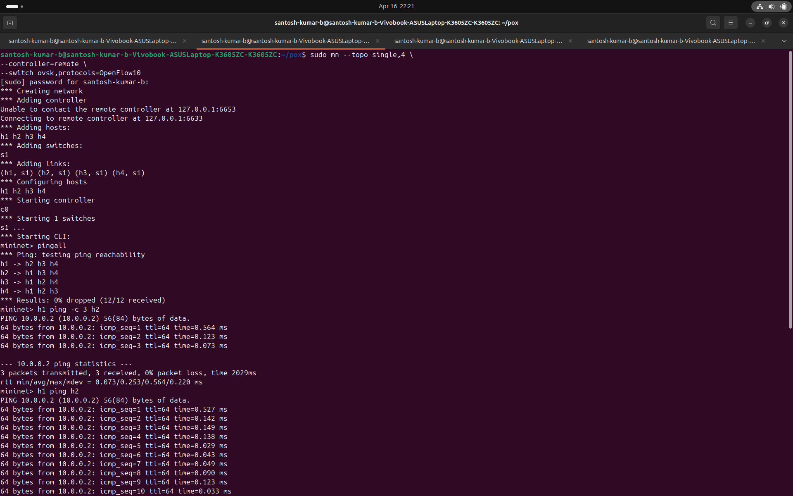
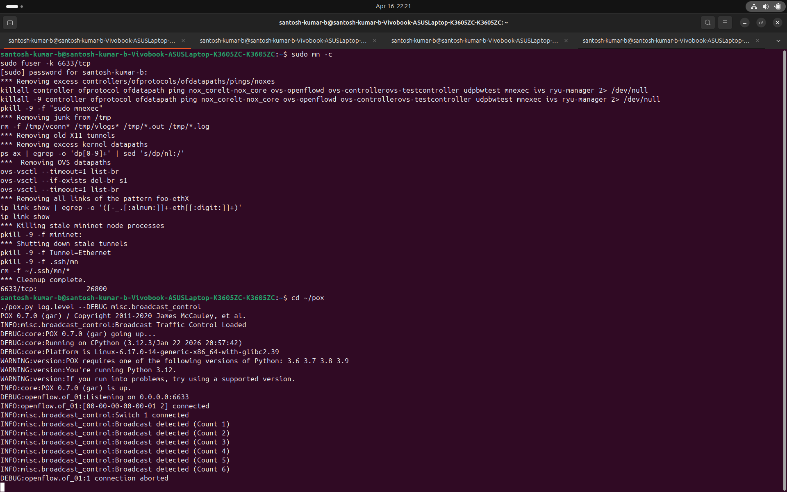
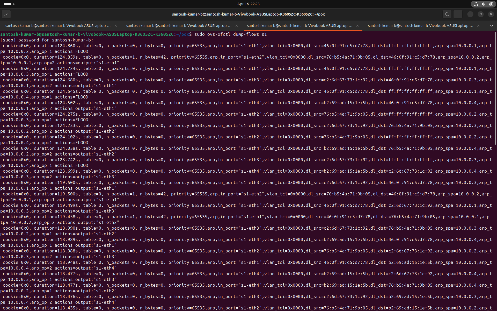
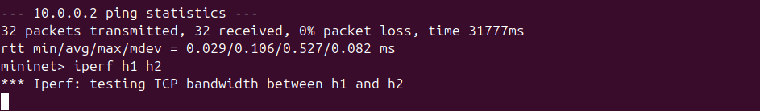
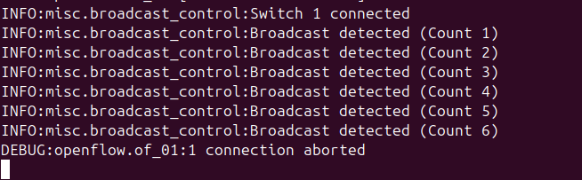
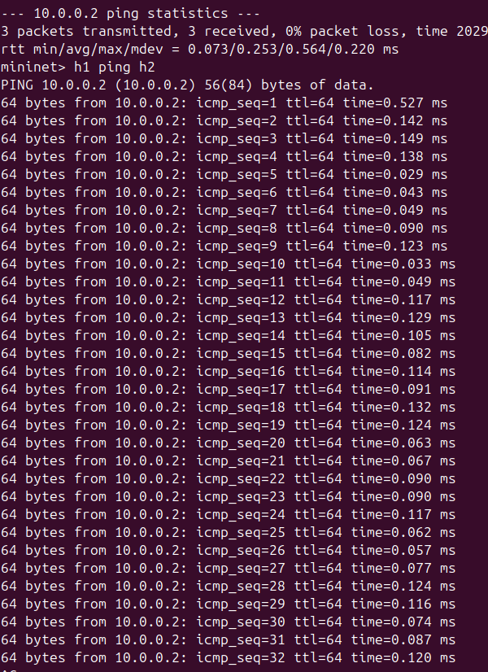

# Broadcast Traffic Control using POX (SDN)

## 📌 Problem Statement

Broadcast traffic (e.g., ARP requests) can cause excessive flooding in a network, leading to congestion and reduced performance. Traditional networks cannot efficiently control such traffic.

## 🎯 Objective

To detect and control excessive broadcast traffic using Software Defined Networking (SDN) with a POX controller.

---

## 🛠️ Tools & Technologies

* Mininet (network simulation)
* POX Controller
* OpenFlow Protocol
* Wireshark (optional)
* iperf (performance testing)

---

## 🏗️ Network Topology

* 1 Switch (Open vSwitch)
* 4 Hosts (h1, h2, h3, h4)
* 1 Controller (POX)

---

## ⚙️ How It Works

1. Switch sends unknown packets to controller (Packet-In)
2. Controller detects broadcast packets (MAC = ff:ff:ff:ff:ff:ff)
3. Limits excessive broadcast traffic using logic
4. Installs flow rules in switch (OpenFlow)
5. Allows only required traffic → reduces flooding

---

## ▶️ How to Run

### Step 1: Start POX Controller

```bash
cd ~/pox
./pox.py misc.broadcast_control
```

### Step 2: Start Mininet

```bash
sudo mn --topo single,4 --controller=remote --switch ovsk,protocols=OpenFlow10
```

### Step 3: Test Connectivity

```bash
pingall
```

### Step 4: Generate Traffic

```bash
h1 ping h2
iperf h1 h2
```

---

## 🔍 Key Features

* Broadcast packet detection
* Broadcast traffic limiting
* MAC learning
* OpenFlow flow rule installation
* Improved network performance

---

## 📊 Results

* Initial broadcast flooding reduced
* Packet loss decreased
* Efficient packet forwarding achieved


## 📸 Screenshots

### 🔹 Mininet Topology Setup



---

### 🔹 PingAll Result (Connectivity Test)



✔ Shows successful communication between all hosts

---

### 🔹 Ping Test Between Hosts



✔ Demonstrates low latency and stable communication

---

### 🔹 Iperf Performance Test



✔ Measures TCP bandwidth between hosts

---

### 🔹 Broadcast Detection in Controller



✔ Controller detects broadcast packets and counts them

---

### 🔹 OpenFlow Flow Rules



✔ Shows installed flow rules in switch (ovs-ofctl)

---


## 🔄 OpenFlow Rules Verification

```bash
sudo ovs-ofctl dump-flows s1
```

---

## 📈 Performance Evaluation

* Tested using `ping` and `iperf`
* Reduced unnecessary broadcast traffic
* Improved latency and throughput

---

## ✅ Conclusion

The SDN-based approach effectively controls broadcast traffic using centralized control logic, improving network efficiency.

---

## 🚀 Future Scope

* Dynamic threshold adjustment
* Multi-switch topology
* AI-based traffic control

